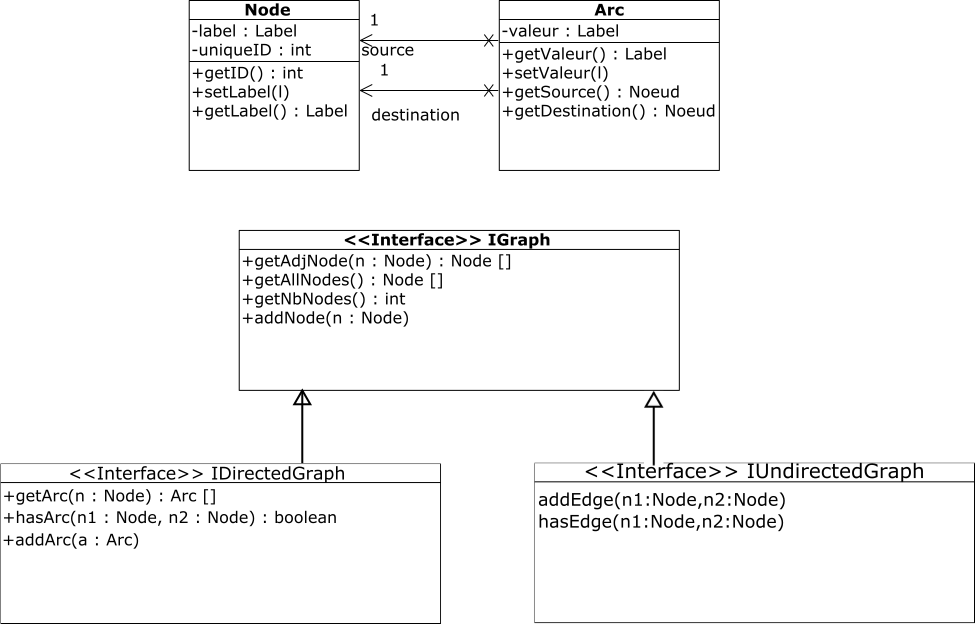

# ISI 3 TP : Graph et Designs Patterns 
Laëtitia Matignon

> Le rapport est à saisir dans le ficher [RAPPORTTP.md](RAPPORTTP.md) en utilisant le [formalisme MarkDown](https://guides.github.com/features/mastering-markdown/).

On souhaite utiliser le package **graph** représenté sur la figure 1. Ce package permet de manipuler des graphes potentiellement orientés, valués, étiquetés.
Un cas d’utilisation type de ce package est le suivant. Pour construire un graphe orienté composé de quatre noeuds 1,2,3,A et comportant une arête valuée entre 1 et 2 et entre 2 et 1,
et des arrêtes non valuées entre 2 et 3, 3 et 2, 1 et 3, on pourra utiliser le code suivant :

```java
Node n1 = new Node(new IntegerLabel(1)); 
Node n2 = new Node(new IntegerLabel(2)); 
Node n3 = new Node(new IntegerLabel(3)); 
Node n4 = new Node(new StringLabel("A"));
Arc a1 = new Arc(n1,n2, new DoubleLabel(0.1));
Arc a1reversed = new Arc(n2,n1, new IntegerLabel(2)); 
Arc a2 = new Arc(n2,n3, null);
Arc a2reversed = new Arc(n3,n2, null);
Arc a3 = new Arc(n1,n3, null);
IDirectedGraph g = new Graph() ;
g.addNode(n1); 
g.addNode(n2); 
g.addNode(n3); 
g.addNode(n4);
g.addArc(a1); 
g.addArc(a1reversed); 
g.addArc(a2);
g.addArc(a2reversed);
g.addArc(a3);
System.out.println(g);
System.out.println(g.hasArc(n1, n2)+" "+g.hasArc(n2, n4));
System.out.println(g.getAdjNodes(n3));
```

L’affichage pourra alors **ressembler** à ce qui suit :

```java
Graph
[noeud=3 : [3 ==> 2(null)]
[noeud=A : []
[noeud=2 : [2 ==> 1(2), 2 ==> 3(null)] [noeud=1 : [1 ==> 2(0.1), 1 ==> 3(null)]
true false
[2]
```

#### Question 1 
Complétez la [classe Graph](src/graphe/Graph.java) qui implémente l’interface [IDirectedGraph](src/graphe/IDirectedGraph.java) (complétez les méthodes spécifiées « A COMPLETER »). 
Vérifiez votre implémentation, vous pouvez entre autre utiliser la classe [TestGraph](src/graphe/TestGraph.java) des tests.


On souhaite maintenant manipuler des graphes non orientés et non valués en implémentant l’interface [IUndirectedGraph](src/graphe/IUndirectedGraph.java).




#### Question 2

Proposez une application d’un patron de conception permettant cela **en maximisant l’utilisation du code déjà existant**. 
Implémentez votre solution dans une classe **UndirectedGraph**.

On souhaite maintenant réaliser un parcours en largeur sur un graphe, à partir d’un sommet donné. 
Vous trouverez l’algorithme de parcours en largeur non-récursif sur [http://fr.wikipedia.org/wiki/Algorithme_de_parcours_en_largeur](http://fr.wikipedia.org/wiki/Algorithme_de_parcours_en_largeur).

#### Question 3
Implémentez une classe permettant de réaliser ce parcours en largeur sur tout type de [IGraph](src/graphe/IGraph.java). 
Vous utiliserez le pattern **Iterateur** pour accéder aux sommets un par un, dans l’ordre du parcours. 
Notamment, décommentez dans [IGraph](src/graphe/IGraph.java) la méthode *creerBFSIterator*, qui renvoie un itérateur pour le parcours en largeur.

Vous pouvez utiliser l’interface Java **Iterator<E>** détaillée dans la javadoc : [https://docs.oracle.com/javase/8/docs/api/java/util/Iterator.html](https://docs.oracle.com/javase/8/docs/api/java/util/Iterator.html).

Vérifiez votre implémentation sur différents graphs, vous pouvez entre autre utiliser la classe [TestSearch](src/graphe/TestSearch.java) des tests.

L’utilisation d’une pile au lieu d’une file d’attente dans l’algorithme de parcours en largeur précédent transforme cet algorithme en un algorithme de parcours en profondeur.

#### Question 4
Implémentez une classe permettant de réaliser un parcours en profondeur sur un graphe, 
à partir d’un sommet donné. Vous utiliserez le pattern **Iterateur** pour accéder aux sommets un par un, 
dans l’ordre du parcours. Notamment, décommentez dans [IGraph](src/graphe/IGraph.java) la méthode *creerDFSIterator*, 
qui renvoie un itérateur pour le parcours en profondeur.

Votre conception devra factoriser le comportement commun aux différents algorithmes de parcours. 
Testez votre proposition sur différents graph, par exemple, vous pouvez utiliser la classe [TestSearch](src/graphe/TestSearch.java) des tests.
