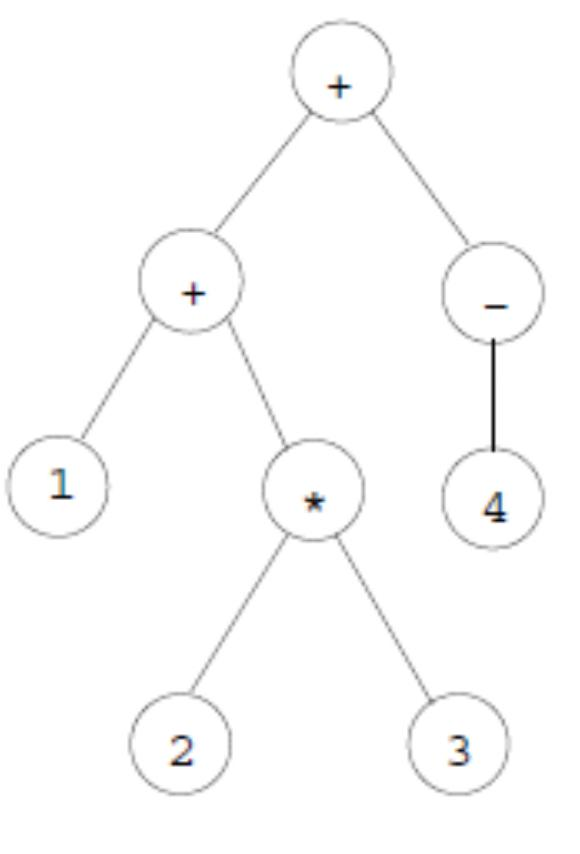
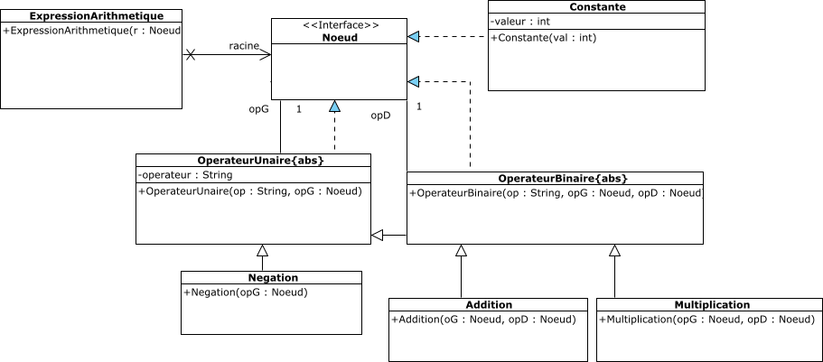

# ISI 3 TP : Arbre et Design Pattern Visiteur
Laëtitia Matignon

> Le rapport est à saisir dans le ficher [RAPPORTTP.md](RAPPORTTP.md) en utilisant le [formalisme MarkDown](https://guides.github.com/features/mastering-markdown/).

On souhaite développer un ensemble de classes permettant d’effectuer des opérations (évaluation, affichage selon différents parcours, ...) sur des expressions arithmétiques. 
On se restreindra ici aux opérations habituelles de l’arithmétique sur les entiers à savoir l’addition, la multiplication, la soustraction et l’inverse du signe. 
Une expression arithmétique que l’on considérera par exemple sera 1 + 2 × 3 + (−4).

Les constituants de l’expression peuvent être : 
* des opérateurs binaires comme +et × 
* des opérateurs unaires comme −
* des constantes qui sont des entiers.

Pour représenter une expression arithmétique, on peut utiliser un arbre binaire (arbre dont chaque noeud a un maximum de deux fils). 
Par exemple, l’expression arithmétique 1 + 2 × 3 + (−4) peut être représentée par l’arbre de la figure 1.

On souhaite pouvoir calculer la valeur de l'expression arithmétique, ou afficher l'expression arithmétique selon différents types de parcours des noeuds:
* Le parcours infixe parcourt d’abord la partie à gauche du noeud, le noeud lui-même et ensuite la partie à droite du noeud. Le parcours infixe de notre exemple
donne : 1+2×3+(−4)
* Le parcours préfixe parcourt d’abord le noeud lui-même, ensuite la partie gauche
du noeud et ensuite sa partie droite. Le parcours préfixe de notre exemple donne : + +1×2 3−4
* Le parcours postfixe parcourt d’abord la partie gauche d’un noeud, ensuite la
partie droite du noeud et le noeud est scruté en dernier. Le parcours postfixe de notre exemple donne : 123 × +4 − +

### Exercice 1
#### Question 1

Complétez le code du [package exerciceVisiteur1](src/exerciceVisiteur1/) de sorte à pouvoir calculer la valeur d'une expression arithmétique et l'afficher selon un affichage postfixe. 

Vous pouvez tester votre code avec la classe [classe TestArbreBinaire](src/exerciceVisiteur1/TestArbreBinaire.java) 

#### Question 2

Comment ajouter d'autres opérations sur l'expression arithmétique ? Par exemple, d'autres types de parcours ou le calcul de la hauteur de l'arbre ? Discutez la facilité d’ajouter d'autres opérations.

### Exercice 2

On va maintenant refactorer le code précédent en utilisant le patron de conception *Visiteur*. En effet, on souhaite appliquer un ensemble d’opérations sur tous les éléments d’une expression arithmétique. Et les implémentations de chaque opération seront spécifiques à chaque élément. Ce pattern va permettre d’encapsuler les différentes opérations de traitement en dehors des classes spécifiques aux éléments et ainsi d’apporter de la souplesse pour l’ajout de nouvelles opérations.

#### Question 3

Complétez le diagramme de classe ci-dessus de sorte à pouvoir appliquer le patron de conception *Visiteur*. 
En particulier, une interface **Visiteur** permettra de visiter tous les éléments de l’arbre.

#### Question 4

Complétez le code du package [package exerciceVisiteur2](src/exerciceVisiteur2/) avec les modifications proposées à la question précédente.

L’objectif est maintenant de définir différents Visiteurs. **Vous ne devez normalement plus toucher au code de l’arbre binaire.**

#### Question 5

Définissez, implémentez et testez un Visiteur pour afficher une expression en notation postfixe. 
Ce type de notation permet de se passer de parenthèses.

#### Question 6

Définissez, implémentez et testez un Visiteur pour calculer la valeur d’une expression arithmétique.

#### Question 7

Définissez, implémentez et testez un Visiteur pour afficher une expression en notation infixe. 
Il sera ici nécessaire d’utiliser des parenthèses si la priorité d’un nœud (en fait, celle de l’opérateur associé à ce nœud) est plus faible que la priorité du père de ce nœud (par exemple 7x(2+x)). 
**Le code de l’arbre binaire pourra être modifié pour cette question.**

#### Question 8
Discutez la facilité d’ajouter d'autres opérations sur l'expression arithmétique.
Discutez la facilité d’ajouter d'autres types de Noeud à l'expression arithmétique.

